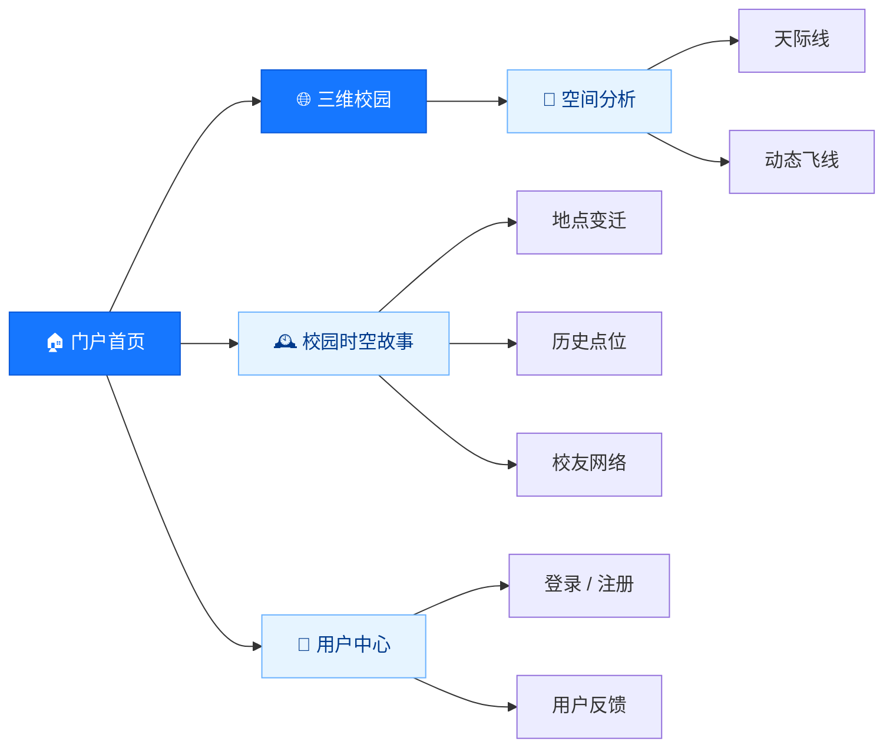
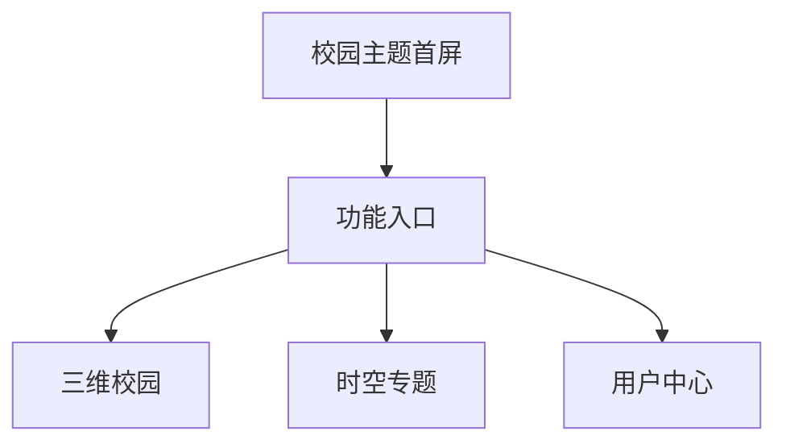
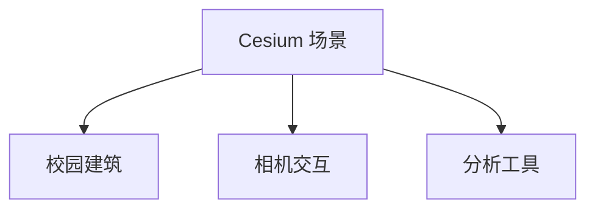
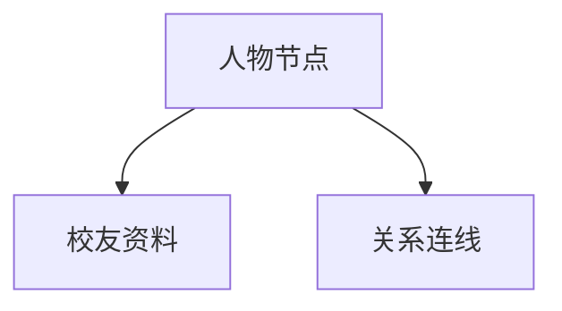
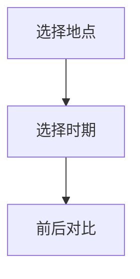
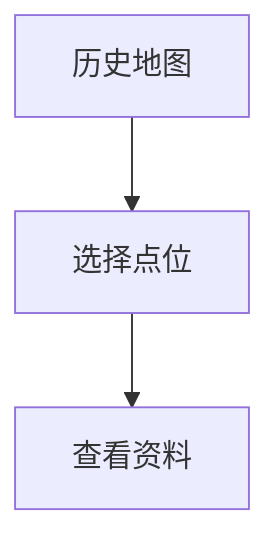
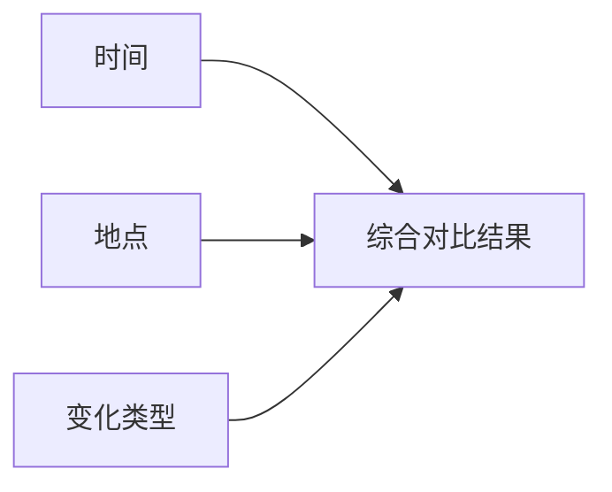
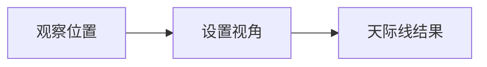
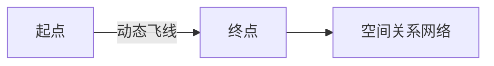
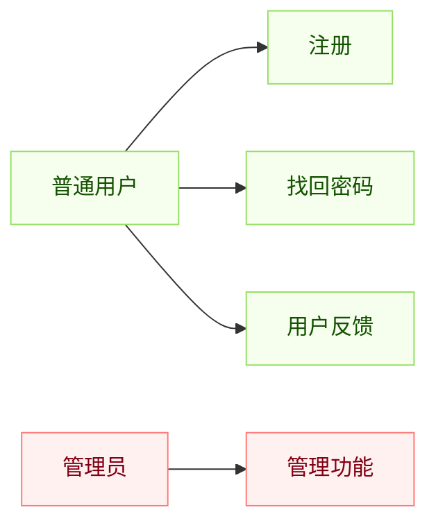

<div align="center">

# 🌏 GIS Server

### Cesium 三维校园地理信息可视化平台

以三维校园为核心，融合历史地点、校友网络、时空变迁与空间分析。

[](https://vuejs.org/)
[](https://cesium.com/)
[](https://vitejs.dev/)
[](https://echarts.apache.org/)
[](#三维数据)

<br>

**[快速开始](#-快速开始) · [界面导览](#-界面导览) · [路由列表](#-路由速查) · [部署说明](#-构建与部署) · [常见问题](#-常见问题)**

</div>

---

## ✨ 项目亮点

| 🌐 三维校园 | 🕰️ 时空叙事 | 👥 人物网络 | 📐 空间分析 |
| :---: | :---: | :---: | :---: |
| Cesium 地球与校园建筑 | 地点变迁与历史点位 | 校友资料与关系展示 | 天际线、阴影、可视域 |
| 多级 3D Tiles 加载 | 多时期信息对比 | D3 / ECharts 可视化 | Turf 空间计算支持 |

> [!IMPORTANT]
> 仓库包含大量 `.b3dm` 三维瓦片，克隆时间和磁盘占用明显高于普通前端项目。只下载源码但遗漏 `public/` 中的瓦片数据时，页面可以启动，但校园三维模型不会完整显示。

## 🧭 系统概览



GIS Server 是一个基于 Vue 3、Vite 和 Cesium 的 WebGIS 项目。系统以三维校园场景为主入口，将地理空间数据、校园历史信息和人物关系组织在统一的浏览器应用中。

## 🛠️ 技术栈

| 层次 | 技术 | 用途 |
| --- | --- | --- |
| 前端框架 | Vue 3 | 组件与页面组织 |
| 工程工具 | Vite 2 | 开发服务器与生产构建 |
| 三维 GIS | Cesium 1.92 | 地球、相机、三维场景与分析 |
| 三维数据 | 3D Tiles / B3DM | 校园建筑分级加载 |
| 路由与状态 | Vue Router 4 / Vuex 4 | Hash 路由与状态管理 |
| 图表网络 | ECharts / D3 / d3-cloud | 图表、关系图和词云 |
| 空间计算 | Turf.js | 浏览器端空间分析 |
| 二维地图 | Leaflet | 二维地图能力 |
| 网络请求 | Axios | 接口和数据请求 |
| 样式 | CSS / Less | 页面布局与主题 |

## 🚀 快速开始

### 运行环境

- Node.js 16 或 18
- npm 8 或更高版本
- 支持 WebGL 2.0 的 Chrome / Edge
- 建议 8 GB 以上内存，并使用独立显卡浏览大型三维场景

### 安装与启动

```bash
git clone https://github.com/123poorchinwe/GIS_Server.git
cd GIS_Server
npm install
npm run dev
```

打开终端显示的网址，通常是：

```text
http://localhost:5173
```

项目使用 Hash 路由，专题页面地址类似：

```text
http://localhost:5173/#/earth
```

## 🖼️ 界面导览

> 下列图片为依据当前路由和组件结构绘制的界面结构示意，并非运行截图。它们用于快速说明每个页面的内容和操作路径。

### 核心场景

<table>
<tr>
<td width="50%" valign="top">

#### 🏠 门户首页

`/#/` · `main_page.vue`

系统品牌、功能导航与专题入口。适合作为所有功能的统一起点。



</td>
<td width="50%" valign="top">

#### 🌐 三维地球

`/#/earth` · `cesiumMap.vue`

加载 Cesium 地球和校园 3D Tiles，是平台的核心交互场景。



</td>
</tr>
</table>

三维场景常用操作：

| 操作 | 作用 |
| --- | --- |
| 左键拖动 | 旋转或平移场景 |
| 鼠标滚轮 | 拉近或拉远视角 |
| 右键拖动 | 调整观察角度，具体取决于控制器配置 |
| 停止移动 | 等待更高精度瓦片逐步加载 |

### 校园时空专题

<table>
<tr>
<td width="33%" valign="top">

#### 👥 校友网络

`/#/schoolmate`

人物节点、校友资料和关系连线。



</td>
<td width="33%" valign="top">

#### 🏛️ 地点变迁

`/#/location`

按地点和年代浏览校园空间变化。



</td>
<td width="33%" valign="top">

#### 📍 历史点位

`/#/history`

通过地图点位查看年代、简介和资料。



</td>
</tr>
</table>

<details>
<summary><strong>🧩 综合变化界面</strong>　<code>/#/complex</code></summary>

综合变化页面从时间、地点和变化类型三个维度组织内容。



</details>

### 三维分析专题

<table>
<tr>
<td width="50%" valign="top">

#### 📐 天际线分析

`/#/skyline`

设置观察位置和视角后提取场景天际轮廓。应先等待三维模型加载完成。



</td>
<td width="50%" valign="top">

#### ✈️ 动态飞线

`/#/flyline` · `fly_line.vue`

使用动态线条表达地点之间的迁移、联系或流向。



</td>
</tr>
</table>

### 用户与管理



<details>
<summary><strong>👤 普通用户</strong>　<code>/#/normaluser</code></summary>

提供账号和密码输入、登录、注册与找回密码入口。实际鉴权是否生效取决于后端服务。

</details>

<details>
<summary><strong>🛡️ 管理员</strong>　<code>/#/superuser</code></summary>

提供管理员身份入口和管理功能区。前端界面不等同于安全权限控制，生产系统必须由后端完成鉴权和授权。

</details>

<details>
<summary><strong>📝 用户注册</strong>　<code>/#/register</code></summary>

填写用户信息、校验必填项并提交注册。验证码、用户入库等功能需要后端接口支持。

</details>

<details>
<summary><strong>🔑 找回密码</strong>　<code>/#/forget</code></summary>

输入账号信息、完成身份验证并设置新密码。邮件或短信发送需要额外服务支持。

</details>

<details>
<summary><strong>💬 用户反馈</strong>　<code>/#/feedback</code></summary>

用于提交问题描述和建议。推荐同时填写复现步骤、浏览器版本和联系方式。

</details>

## 🗺️ 路由速查

| 页面 | Hash 地址 | 组件 / 模块 |
| --- | --- | --- |
| 🏠 门户首页 | `/#/` | `main_page.vue` |
| 🌐 三维地球 | `/#/earth` | `cesiumMap.vue` |
| 🛡️ 管理员 | `/#/superuser` | `super_user.vue` |
| 👤 普通用户 | `/#/normaluser` | `normal_user.vue` |
| 📝 用户注册 | `/#/register` | `register.vue` |
| 🔑 找回密码 | `/#/forget` | `forget_code.vue` |
| 💬 用户反馈 | `/#/feedback` | `user_feedback.vue` |
| 👥 校友网络 | `/#/schoolmate` | `schoolmate_network.vue` |
| 🏛️ 地点变迁 | `/#/location` | `location_change.vue` |
| 📍 历史点位 | `/#/history` | `history_point.vue` |
| 🧩 综合变化 | `/#/complex` | `complex_change.vue` |
| 📐 天际线 | `/#/skyline` | 天际线分析模块 |
| ✈️ 动态飞线 | `/#/flyline` | `fly_line.vue` |

## 📁 项目结构

```text
GIS_Server/
├─ public/
│  ├─ 7/ 8/ 9/ 10/ ...       # 多级 B3DM 三维瓦片
│  ├─ tileset*.json           # 3D Tiles 入口与分块配置
│  └─ title.png               # 公共界面资源
├─ src/
│  ├─ assets/
│  │  ├─ location_change/     # 地点变迁数据
│  │  └─ school_mate/         # 校友头像和关系资料
│  ├─ components/             # 页面与业务组件
│  ├─ router/index.js         # Hash 路由
│  ├─ utils/                  # Cesium 与空间分析工具
│  ├─ App.vue
│  └─ main.js
├─ docs/examples/             # 示例 Notebook
├─ notebooks/                 # 栅格处理 Notebook
├─ package.json
└─ vite.config.js
```

## 🧱 三维数据

- `public/tileset.json` 和 `tileset_*.json` 是 3D Tiles 入口。
- 数字目录中的 `.b3dm` 是实际三维瓦片，不应随意改名或移动。
- tileset JSON 中的相对路径必须和瓦片目录一致。
- 建议将大型三维资源迁移至 Git LFS、对象存储或独立静态资源服务器。
- 发布服务器需要允许访问 `.json` 和 `.b3dm`，并为 B3DM 配置合适的 MIME 类型。

## 📦 构建与部署

```bash
npm run build
npm run preview
```

生产部署检查清单：

- [ ] `dist/` 已完整上传
- [ ] Cesium 静态资源路径正确
- [ ] `tileset*.json` 请求返回 HTTP 200
- [ ] `.b3dm` 文件可正常访问
- [ ] 部署子目录与 Vite `base` 一致
- [ ] 13 个 Hash 路由均已逐页检查
- [ ] 浏览器控制台无 WebGL、跨域或资源路径错误

## ❓ 常见问题

<details>
<summary><strong>三维模型没有显示</strong></summary>

检查浏览器 Network 面板中的 `tileset*.json` 与 `.b3dm` 请求；确认路径、文件大小、跨域设置和服务器 MIME 类型正确。大型瓦片首次加载需要等待。

</details>

<details>
<summary><strong>页面刷新后出现 404</strong></summary>

项目采用 Hash 路由，地址应包含 `/#/`。Hash 后面的路径不会交给服务器解析。

</details>

<details>
<summary><strong>场景卡顿或显存占用过高</strong></summary>

降低窗口分辨率，减少同时加载的 tileset，并调整 Cesium 屏幕空间误差和缓存策略。

</details>

<details>
<summary><strong>登录、注册或反馈无法真正提交</strong></summary>

检查 Axios 接口地址和后端服务。部署前端静态文件不会自动提供用户数据库、鉴权、验证码和反馈存储。

</details>

<details>
<summary><strong>修改 JSON 后页面没有变化</strong></summary>

确认 JSON 语法、字段名称和图片路径正确，然后清除浏览器缓存并重新构建。

</details>

## 🤝 开发约定

- Token、接口地址等环境配置放入 `.env`，不要提交真实密钥。
- 大型 3D Tiles 使用独立版本和备份，避免代码提交反复传输二进制资源。
- 新增页面时同步更新 `src/router/index.js` 和本 README。
- 合并代码前运行 `npm run build`，并检查相关路由。

---

<div align="center">

**GIS Server · 让校园的空间、历史与人物关系在三维世界中被看见**

<sub>当前仓库尚未提供独立开源许可证；复制、分发或二次开发前请先联系项目所有者。</sub>

</div>
