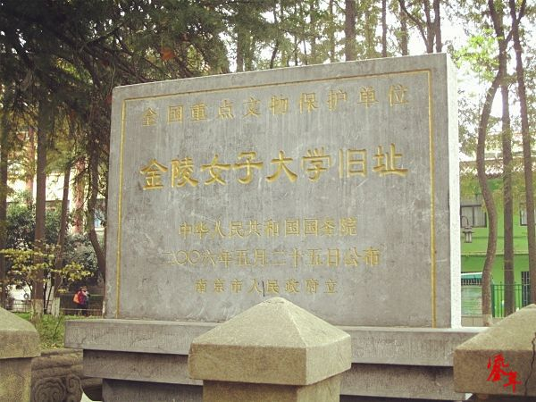

<div align="center">

  <br><br>
  <h1>GIS Server</h1>
  <p><b>Cesium 三维校园地理信息可视化平台</b></p>
  <p>让校园的空间、历史与人物关系，在三维世界中被看见。</p>
  <br>
  <a href="https://vuejs.org/"></a>
  <a href="https://cesium.com/"></a>
  <a href="https://vitejs.dev/"></a>
  
  
  <br><br>
  <a href="#quick-start">快速开始</a> ·
  <a href="#screens">界面展示</a> ·
  <a href="#features">核心功能</a> ·
  <a href="#routes">页面路由</a> ·
  <a href="#deploy">部署指南</a>
</div>

<br>

<table>
  <tr>
    <td align="center" width="25%"><b>🌐 三维校园</b><br><sub>Cesium 与 3D Tiles</sub></td>
    <td align="center" width="25%"><b>🕰️ 时空叙事</b><br><sub>地点与历史变迁</sub></td>
    <td align="center" width="25%"><b>👥 校友网络</b><br><sub>人物关系可视化</sub></td>
    <td align="center" width="25%"><b>📐 空间分析</b><br><sub>天际线、阴影、可视域</sub></td>
  </tr>
</table>

<blockquote>
  <b>项目提示</b><br>
  仓库包含大量 B3DM 三维瓦片，完整克隆和首次加载会比普通前端项目更慢。缺少 <code>public</code> 中的瓦片资源时，网页可以启动，但校园模型无法完整显示。
</blockquote>

<a id="screens"></a>
<h2>界面展示</h2>

<p>以下图片均使用仓库中的项目资源，展示系统的视觉风格与主要内容。</p>

<div align="center">
  
  <p><sub>系统主题界面</sub></p>
</div>

<table>
  <tr>
    <td width="50%" align="center">
      <br>
      <b>校园专题</b><br>
      <sub>校园空间、历史与专题内容入口</sub>
    </td>
    <td width="50%" align="center">
      <br>
      <b>三维地理信息</b><br>
      <sub>Cesium 场景与校园建筑数据</sub>
    </td>
  </tr>
  <tr>
    <td width="50%" align="center">
      <br>
      <b>用户中心</b><br>
      <sub>登录、注册、密码找回与反馈</sub>
    </td>
    <td width="50%" align="center">
      <br>
      <b>校园历史</b><br>
      <sub>历史点位与地点变迁展示</sub>
    </td>
  </tr>
</table>

<p align="center"><i>部分页面需要启动项目并加载三维瓦片后才能看到完整交互效果。</i></p>

<a id="features"></a>
<h2>核心功能</h2>

<table>
  <tr>
    <td width="50%" valign="top">
      <h3>🌍 三维校园浏览</h3>
      <p>在 Cesium 地球中加载校园建筑 3D Tiles，支持相机旋转、缩放、倾斜和逐级精细化加载。</p>
    </td>
    <td width="50%" valign="top">
      <h3>🏛️ 校园地点变迁</h3>
      <p>按照地点与年代组织校园资料，对比不同历史阶段中的建筑、环境和空间变化。</p>
    </td>
  </tr>
  <tr>
    <td width="50%" valign="top">
      <h3>👥 校友关系网络</h3>
      <p>结合人物头像、资料与关系连线，展示校友之间的联系和群体结构。</p>
    </td>
    <td width="50%" valign="top">
      <h3>📍 历史点位</h3>
      <p>通过地图标记组织历史地点和事件，查看年代、简介及关联图片资料。</p>
    </td>
  </tr>
  <tr>
    <td width="50%" valign="top">
      <h3>📐 三维空间分析</h3>
      <p>项目包含天际线、阴影和可视域等 Cesium 空间分析工具代码。</p>
    </td>
    <td width="50%" valign="top">
      <h3>✈️ 动态飞线</h3>
      <p>使用动态线条表达地点之间的迁移、联系、访问路径或空间流向。</p>
    </td>
  </tr>
</table>

<a id="quick-start"></a>
<h2>快速开始</h2>

<h3>环境要求</h3>

<ul>
  <li>Node.js 16 或 18</li>
  <li>npm 8 或更高版本</li>
  <li>支持 WebGL 2.0 的 Chrome 或 Edge</li>
  <li>建议使用 8 GB 以上内存和独立显卡</li>
</ul>

<h3>安装与运行</h3>

```bash
git clone https://github.com/123poorchinwe/GIS_Server.git
cd GIS_Server
npm install
npm run dev
```

在浏览器中打开终端显示的地址，通常是：

```text
http://localhost:5173
```

本项目使用 Hash 路由，三维场景地址示例：

```text
http://localhost:5173/#/earth
```

<h3>三维场景操作</h3>

<table>
  <tr><th>操作</th><th>作用</th></tr>
  <tr><td>左键拖动</td><td>旋转或平移场景</td></tr>
  <tr><td>鼠标滚轮</td><td>拉近或拉远视角</td></tr>
  <tr><td>右键拖动</td><td>调整观察角度，具体行为取决于控制器配置</td></tr>
  <tr><td>停止移动</td><td>等待更高精度的三维瓦片逐步加载</td></tr>
</table>

<a id="routes"></a>
<h2>页面路由</h2>

<table>
  <tr><th>页面</th><th>访问地址</th><th>主要用途</th></tr>
  <tr><td>🏠 门户首页</td><td><code>/#/</code></td><td>品牌展示和功能导航</td></tr>
  <tr><td>🌐 三维地球</td><td><code>/#/earth</code></td><td>Cesium 校园三维场景</td></tr>
  <tr><td>🛡️ 管理员</td><td><code>/#/superuser</code></td><td>管理员入口和管理功能</td></tr>
  <tr><td>👤 普通用户</td><td><code>/#/normaluser</code></td><td>普通用户登录入口</td></tr>
  <tr><td>📝 用户注册</td><td><code>/#/register</code></td><td>填写并提交注册资料</td></tr>
  <tr><td>🔑 找回密码</td><td><code>/#/forget</code></td><td>身份验证和密码重置</td></tr>
  <tr><td>💬 用户反馈</td><td><code>/#/feedback</code></td><td>提交问题与建议</td></tr>
  <tr><td>👥 校友网络</td><td><code>/#/schoolmate</code></td><td>人物资料和关系图</td></tr>
  <tr><td>🏛️ 地点变迁</td><td><code>/#/location</code></td><td>地点与年代对比</td></tr>
  <tr><td>📍 历史点位</td><td><code>/#/history</code></td><td>历史地点和事件资料</td></tr>
  <tr><td>🧩 综合变化</td><td><code>/#/complex</code></td><td>多维度变化信息</td></tr>
  <tr><td>📐 天际线</td><td><code>/#/skyline</code></td><td>三维场景天际轮廓分析</td></tr>
  <tr><td>✈️ 动态飞线</td><td><code>/#/flyline</code></td><td>空间联系动态展示</td></tr>
</table>

<h2>技术架构</h2>

<table>
  <tr><th>分类</th><th>技术</th><th>用途</th></tr>
  <tr><td>前端框架</td><td>Vue 3</td><td>组件与页面组织</td></tr>
  <tr><td>开发构建</td><td>Vite 2</td><td>开发服务器和生产打包</td></tr>
  <tr><td>三维 GIS</td><td>Cesium 1.92</td><td>地球、相机、模型和空间分析</td></tr>
  <tr><td>三维数据</td><td>3D Tiles / B3DM</td><td>校园建筑分级加载</td></tr>
  <tr><td>可视化</td><td>ECharts / D3</td><td>图表和关系网络</td></tr>
  <tr><td>空间计算</td><td>Turf.js</td><td>浏览器端空间分析</td></tr>
  <tr><td>二维地图</td><td>Leaflet</td><td>二维地图展示</td></tr>
  <tr><td>网络请求</td><td>Axios</td><td>接口和数据加载</td></tr>
</table>

<h2>项目结构</h2>

```text
GIS_Server/
├─ public/
│  ├─ 7/ 8/ 9/ 10/ ...       多级 B3DM 三维瓦片
│  ├─ tileset*.json           3D Tiles 入口配置
│  └─ title.png               项目标题图片
├─ src/
│  ├─ assets/
│  │  ├─ location_change/     地点变迁数据
│  │  └─ school_mate/         校友头像和关系资料
│  ├─ components/             页面与业务组件
│  ├─ router/index.js         Hash 路由配置
│  ├─ utils/                  Cesium 与空间分析工具
│  ├─ App.vue
│  └─ main.js
├─ docs/examples/             示例 Notebook
├─ notebooks/                 栅格处理 Notebook
├─ package.json
└─ vite.config.js
```

<h2>三维数据</h2>

<ul>
  <li><code>public/tileset.json</code> 和 <code>tileset_*.json</code> 是 3D Tiles 入口。</li>
  <li>数字目录中的 <code>.b3dm</code> 是实际三维瓦片，不要随意改名或移动。</li>
  <li>Tileset JSON 中的相对路径必须与瓦片目录保持一致。</li>
  <li>大型资源建议使用 Git LFS、对象存储或独立静态资源服务器。</li>
  <li>部署服务器应允许访问 JSON 和 B3DM 文件。</li>
</ul>

<a id="deploy"></a>
<h2>构建与部署</h2>

```bash
npm run build
npm run preview
```

<table>
  <tr><th>检查项</th><th>说明</th></tr>
  <tr><td>✅ 静态文件</td><td><code>dist</code> 目录已完整上传</td></tr>
  <tr><td>✅ Cesium 资源</td><td>Widget、Worker 和静态资源路径正确</td></tr>
  <tr><td>✅ Tileset</td><td><code>tileset*.json</code> 请求返回 HTTP 200</td></tr>
  <tr><td>✅ B3DM</td><td>三维瓦片可以访问，MIME 配置正确</td></tr>
  <tr><td>✅ 部署路径</td><td>Vite <code>base</code> 与部署子目录一致</td></tr>
  <tr><td>✅ 页面检查</td><td>13 个 Hash 路由均可正常访问</td></tr>
</table>

<h2>常见问题</h2>

<details>
  <summary><b>三维模型没有显示</b></summary>
  <p>检查浏览器 Network 面板中的 tileset JSON 和 B3DM 请求，确认路径、跨域设置和服务器 MIME 类型正确。大型瓦片首次加载需要等待。</p>
</details>

<details>
  <summary><b>页面刷新后出现 404</b></summary>
  <p>项目使用 Hash 路由，地址应包含 <code>/#/</code>。Hash 后面的路径不会交给服务器解析。</p>
</details>

<details>
  <summary><b>场景卡顿或显存占用过高</b></summary>
  <p>降低窗口分辨率、减少同时加载的 Tileset，并调整 Cesium 的屏幕空间误差和缓存策略。</p>
</details>

<details>
  <summary><b>登录、注册或反馈不能真正提交</b></summary>
  <p>请检查 Axios 接口地址和后端服务。仅部署前端文件不会自动提供数据库、鉴权、验证码和反馈存储。</p>
</details>

<br>

<div align="center">
  <p><b>GIS Server</b></p>
  <p><sub>Vue · Cesium · 3D Tiles · Campus History</sub></p>
  <p><sub>当前仓库尚未提供独立开源许可证，复制或二次分发前请先联系项目所有者。</sub></p>
</div>
